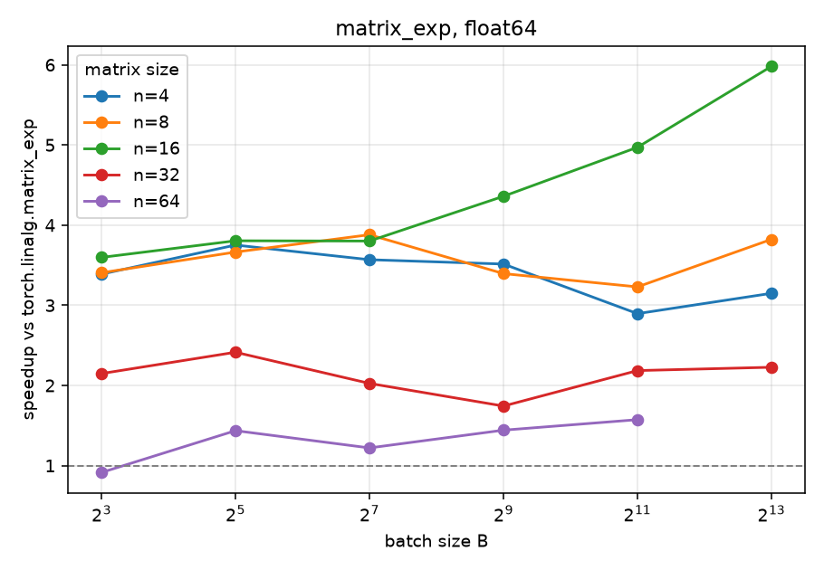
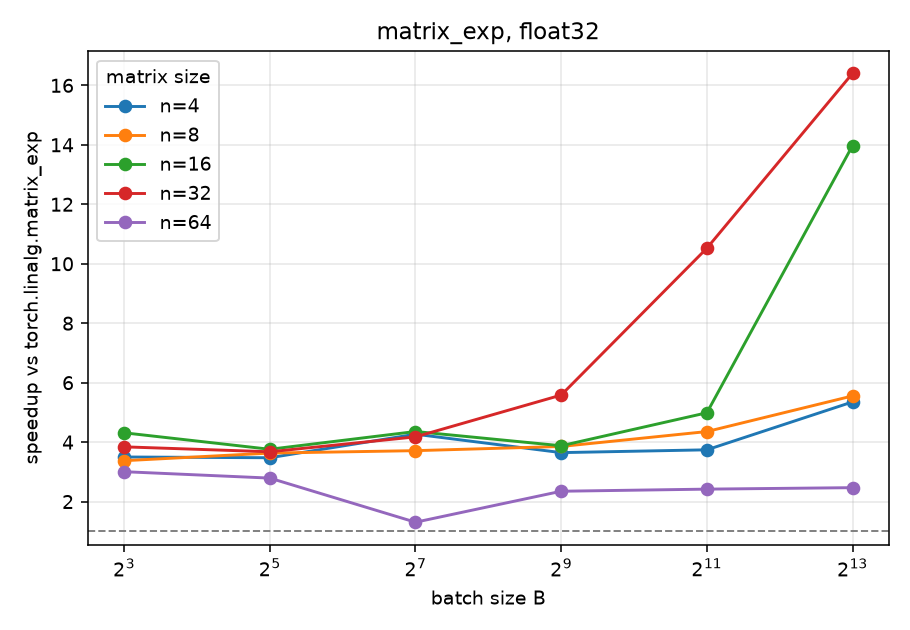

# torch_matfunc

`matrix_exp` and `matrix_log` for batches of small matrices: fused Triton
kernels on CUDA, pure Torch elsewhere. A prototype for
[`pytorch/pytorch#9983`](https://github.com/pytorch/pytorch/issues/9983).

[](https://github.com/abhijeetgangan/torch_matfunc/actions/workflows/ci.yml)
[](https://opensource.org/licenses/MIT)
[](https://www.python.org/downloads/)

## Features

| Function | Algorithm | Triton | Fallback |
| --- | --- | --- | --- |
| `matrix_exp` | Scaling and squaring, degree-18 Taylor | real `n` in `{2,4,8,16,32,64}`, complex `n` in `{2,4,8,16,32}` | pure Torch |
| `matrix_log` | Inverse scaling and squaring, Gauss-Legendre Pade | real and complex `n` in `{2,4,8,16,32}` | pure Torch |

- `torch.linalg`-style API, no SciPy dependency; `hermitian=True` switches to
  batched `eigh`.
- `matrix_log` returns the principal logarithm; the input spectrum must stay
  off the closed negative real axis. The function does not check this.
- Autograd via the block-triangular Frechet identity; the `eigh` path uses
  Daleckii-Krein gradients, finite at repeated eigenvalues. `torch.func`
  transforms compose: `grad`, `jacrev`, `jacfwd`, `hessian`, nested `vmap`.
- `float16` / `bfloat16` computed in `float32` and cast back.
- `torch.compile`: `fullgraph=True` on Triton-routed inputs, automatic graph
  break to eager elsewhere.

## Installation

```bash
pip install -e ".[test]"          # CPU reference + test deps
pip install -e ".[test,triton]"   # adds the Triton kernels; requires CUDA
```

## Quick start

```python
import torch
from torch_matfunc.linalg import matrix_exp, matrix_log

device = "cuda" if torch.cuda.is_available() else "cpu"
A = torch.randn(64, 4, 4, dtype=torch.float64, device=device)

E = matrix_exp(A)
assert torch.allclose(E, torch.linalg.matrix_exp(A), rtol=1e-9, atol=1e-9)

S = A @ A.mT + 4 * torch.eye(4, dtype=torch.float64, device=device)
E_h = matrix_exp(S, hermitian=True)  # SPD / Hermitian input: batched eigh
L = matrix_log(S)  # principal log; matrix_exp(L) recovers S
```

## Performance

`matrix_exp` vs `torch.linalg.matrix_exp`, fp64, RTX 4070 Laptop; median of 20
after warmup, with relative error:

| batch | n | ours_ms | torch_ms | speedup | rel_err_vs_torch |
| --- | --- | --- | --- | --- | --- |
| 256 | 4 | 0.040 | 0.272 | 6.85x | 6.1e-16 |
| 256 | 8 | 0.053 | 0.287 | 5.39x | 1.3e-15 |
| 64 | 16 | 0.054 | 0.274 | 5.11x | 2.5e-15 |
| 64 | 32 | 0.177 | 0.364 | 2.06x | 4.0e-15 |
| 256 | 64 | 4.833 | 6.521 | 1.35x | 8.4e-15 |

fp32 holds about 6x through n=32; complex128 reaches 15.9x for n<=8.

`matrix_log` has no `torch.linalg` counterpart. The public function routes each
input to Triton or to the pure-Torch reference by dtype, `n` and batch count,
following measured crossovers kept in `torch_matfunc/linalg/ops.py`.

Batch-size scaling, regenerated with `uv run benchmarks/plot_scaling.py`:




## Design

- One matrix per Triton program, working set in SRAM. `matrix_exp` keeps its
  per-matrix squaring counts on device with no host synchronization;
  `matrix_log` syncs once every four root launches to stop early.
- `matrix_log` runs inverse scaling and squaring as masked square-root
  launches with per-matrix root counts kept on device, then one Pade launch.
  Its in-kernel inverses limit the Triton route to moderate conditioning,
  about `1e6` in fp64; `hermitian=True` and the pure-Torch reference do not
  share this limit.
- Kernels avoid nested data-dependent control flow and pin `num_stages=1` to
  sidestep Triton pipeliner miscompiles; the squaring count is clamped per
  dtype so inf/NaN inputs finish in bounded time.
- Odd `n` and unsupported sizes use the pure-Torch reference through the same
  public function, including on CUDA. Complex Triton `matrix_exp` stops at
  `n=32` because the complex `n=64` working set exceeds shared memory on
  consumer GPUs.
- `jacfwd(jacfwd(f))` silently returns zeros, a PyTorch limitation; use
  `hessian` or `jacfwd(jacrev)` instead.

## Testing

```bash
pytest tests/                           # CUDA tests skip without a GPU
uv run benchmarks/bench_matrix_exp.py   # exp vs torch.linalg.matrix_exp
```

## License

MIT
